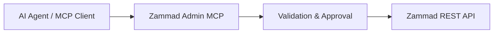

<div align="center">


# Zammad Admin MCP

### Controlled administration interface between AI agents and Zammad

A Model Context Protocol server for secure, auditable and permission-aware Zammad administration workflows.

</div>

---

## Overview

Zammad Admin MCP provides a controlled interface for MCP-compatible AI clients to interact with selected Zammad administration resources.

The project is designed around one principle:

> AI systems may assist administration, but administrative control remains explicit, reviewable and bounded.

Instead of exposing unrestricted API access, Zammad Admin MCP introduces validation, preview workflows and controlled execution paths.

```text
AI Client
    |
    v
MCP Protocol
    |
    v
Zammad Admin MCP
    |
    +-- Resource Allowlist
    +-- Validation Layer
    +-- Preview / Approval Workflow
    +-- Secret Redaction
    +-- Audit-oriented Execution
    |
    v
Zammad API
```

---

# Design Goals

## Security by Design

Zammad Admin MCP intentionally avoids becoming a generic API proxy.

Implemented safeguards:

- allowlisted resources and operations
- controlled write workflows
- preview before apply
- explicit approval requirement
- recursive secret redaction
- no arbitrary URL forwarding
- no arbitrary HTTP method execution
- no direct Rails console access

The MCP server does not grant additional Zammad permissions. The configured API token remains the authority.

---

# Architecture



The architecture separates intent, validation and execution. `zammad_admin_mcp/server.py` registers MCP tools and coordinates allowlists, previews, approvals and stale-state checks. `zammad_admin_mcp/api_transport.py` handles Zammad HTTP transport and endpoint configuration. Secret redaction, environment-backed secret handling and local token storage live in `zammad_admin_mcp/security.py`. Resource-specific payload validation lives in `zammad_admin_mcp/admin_schemas/`.

Administrative operations are not executed merely because the MCP server is connected.

---

# Capabilities

## Read Operations

- server version detection
- allowlisted administration resources
- object inspection
- knowledge base access
- paginated collection reads

## Controlled Changes

Changes follow a prepare/apply workflow:

```text
Prepare Change
       |
       v
Generate Preview
       |
       v
Explicit Approval
       |
       v
Apply Change
```

Supported workflows include:

- create operations
- update operations
- selected delete operations
- selected high-impact configuration changes
- staged inbound mailbox setup/update, enable/disable, deletion, and group reassignment
- jobs, LDAP sources, public links, chats, postmaster filters, and external credentials have staged CRUD with explicit high-impact previews; LDAP discovery and bind checks are separately staged, and bind passwords and external credential secrets use process environment references

Applying a mailbox setup/update plan tests inbound and outbound mail, sends a verification message, saves the channel on success, and starts inbound fetching. Fetched messages can create tickets, so the action is high impact and requires explicit approval.

---

# MCP Tools

Core:

- `zammad_server_version`
- `zammad_list_admin_resources`
- `zammad_list_admin_resource`
- `zammad_get_admin_object`
- `zammad_prepare_admin_change`
- `zammad_apply_admin_change`

Knowledge base:

- `zammad_get_knowledge_base`
- `zammad_get_knowledge_base_permissions`
- `zammad_get_knowledge_base_record`

Compatibility readers:

- groups
- roles
- calendars
- SLAs
- triggers
- ticket states

---

# Installation

```bash
git clone https://github.com/CyberG3niusIT/Zammad-Admin-MCP.git
cd Zammad-Admin-MCP

python -m venv .venv
. .venv/bin/activate
pip install -e .

zammad-admin-mcp
```

Configure the MCP client with the absolute path to the executable.

Store credentials only through environment variables or ignored local configuration. Never put secret literals in tool arguments. For secret fields, pass an environment reference such as `{"$secret_env":"ZAMMAD_SECRET_IMAP_PASSWORD"}`; values must be available to the MCP process and are redacted from previews. Reference names must start with `ZAMMAD_SECRET_` or `MCP_SECRET_`.

---

# Limitations

Zammad Admin MCP does not claim complete Zammad UI coverage.

Currently outside the generic workflow:

- fully verified system settings or mailbox writes: reads and previews work, but no apply was performed
- API token creation: the one-time value is written to an owner-only local file (mode `0600`) in a private directory (mode `0700`); the MCP returns metadata and the path, never the token. This file is not encrypted. Metadata read and staged revocation are available.
- validated LDAP/SSO settings apply behavior: the settings read/preview path covers these entries, but an apply was not performed
- unrestricted object manager migrations

New capabilities should receive dedicated workflows with defined permissions, validation and side effects.

---

# Development Principles

Every administrative capability should define:

- required permissions
- affected resources
- validation rules
- secret handling
- failure behavior
- rollback considerations

The objective is not maximum automation.

The objective is reliable automation.

---

# References

- [Zammad REST API](https://docs.zammad.org/en/latest/api/intro.html)
- [Object Manager API](https://docs.zammad.org/en/latest/api/object.html)
- [Email Notification API](https://docs.zammad.org/en/pre-release/api/email-notification.html)
- [Zammad 7.1.2 email channel routes](https://github.com/zammad/zammad/blob/7.1.2/config/routes/channel_email.rb)

See `ADMIN_COVERAGE.md` for detailed coverage information.

## Website

The static product website is in [`website/index.html`](website/index.html). It has no build step or additional runtime dependencies.

---

## License

Open source project by CyberG3niusIT.
