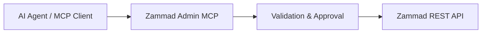

<div align="center">


# Zammad Admin MCP

### Controlled administration interface between AI agents and Zammad

A Model Context Protocol server for secure, auditable and permission-aware Zammad administration workflows.

</div>

---

## Overview

Zammad Admin MCP provides a controlled interface for MCP-compatible AI clients to interact with selected Zammad administration resources.

The project is designed around one principle:

> AI systems may assist administration, but administrative control remains explicit, reviewable and bounded.

Instead of exposing unrestricted API access, Zammad Admin MCP introduces validation, preview workflows and controlled execution paths.

```text
AI Client
    |
    v
MCP Protocol
    |
    v
Zammad Admin MCP
    |
    +-- Resource Allowlist
    +-- Validation Layer
    +-- Preview / Approval Workflow
    +-- Secret Redaction
    +-- Audit-oriented Execution
    |
    v
Zammad API
```

---

# Design Goals

## Security by Design

Zammad Admin MCP intentionally avoids becoming a generic API proxy.

Implemented safeguards:

- allowlisted resources and operations
- controlled write workflows
- preview before apply
- explicit approval requirement
- recursive secret redaction
- no arbitrary URL forwarding
- no arbitrary HTTP method execution
- no direct Rails console access

The MCP server does not grant additional Zammad permissions. The configured API token remains the authority.

---

# Architecture



The architecture separates intent, validation and execution. `zammad_admin_mcp/server.py` registers MCP tools and coordinates allowlists, previews, approvals and stale-state checks. `zammad_admin_mcp/api_transport.py` handles Zammad HTTP transport and endpoint configuration. Secret redaction, environment-backed secret handling and local token storage live in `zammad_admin_mcp/security.py`. Resource-specific payload validation lives in `zammad_admin_mcp/admin_schemas/`.

Administrative operations are not executed merely because the MCP server is connected.

---

# Capabilities

## Read Operations

- server version detection
- allowlisted administration resources
- object inspection
- knowledge base access
- paginated collection reads

## Controlled Changes

Changes follow a prepare/apply workflow:

```text
Prepare Change
       |
       v
Generate Preview
       |
       v
Explicit Approval
       |
       v
Apply Change
```

Supported workflows include:

- create operations
- update operations
- selected delete operations
- selected high-impact configuration changes
- `zammad_list_calendar_timezones` lists the timezone choices used by Zammad's calendar settings
- staged inbound mailbox setup/update, enable/disable, deletion, and group reassignment
- jobs, LDAP sources, public links, chats, postmaster filters, and external credentials have staged CRUD with explicit high-impact previews; LDAP discovery and bind checks are separately staged, and bind passwords and external credential secrets use process environment references
- existing Facebook channel page mappings and lifecycle changes use staged, high-impact previews; OAuth account linking remains in Zammad's browser flow
- existing Microsoft 365 and Microsoft Graph mailbox group, sender address, folder, archive, lifecycle, and probe operations use staged, high-impact previews; probes return only status and message counts, while OAuth account linking remains in Zammad's browser flow
- existing Google mailbox group, sender address, folder, archive, lifecycle, and probe operations use staged, high-impact previews; OAuth account linking remains in Zammad's browser flow
- User CSV import uses Zammad's transactional `try=true` preview, a short-lived in-memory plan, a complete user-inventory stale check, and explicit high-impact approval before import; imported records and row error text are never returned
- Google and Microsoft 365 channels with a stored migration backup can be rolled back through a staged plan that previews restored metadata without showing the saved configuration
- Web channel settings can be listed by Zammad area (for example `CustomerWeb::Base`) and changed through the staged settings workflow
- Google OAuth, SAML, and OpenID Connect settings can be read with safe field projections and updated through provider-specific staged plans; key material uses process environment references
- OAuth applications can be read and changed through staged plans; client secrets and generated bearer tokens are stored in the protected local secret directory and never returned in MCP output. `zammad_prepare_oauth_application_token` stages an application token for the current Zammad user
- Product-logo updates use a staged upload with image type and size validation; previews and apply responses omit image data
- Knowledge Base role access changes use a complete per-role preview, validate against Zammad's eligible roles, and are rejected if the permissions changed after preview
- Translation administration can list customized entries, search suggestions, stage upserts, reset system translations, and delete custom translations
- SSL certificate management can list metadata and stage single-PEM imports or certificate removal; previews never return certificate bodies
- PGP keys and S/MIME certificates/private keys can be listed and changed through dedicated staged workflows. Private keys and passphrases require process environment references; public PGP keys may be provided directly. Reads, previews, and apply results expose only safe metadata and configured booleans
- Package management can list installed packages and stage install/removal plans; install payloads are size-limited and summarized without returning package file contents
- The system report is available as a redacted summary that excludes setting values, environment data, hardware identifiers, paths, and activity timestamps
- Object Manager attribute removals, discarding the entire pending queue, and executing the global migration queue use separate previews; discard does not reverse completed migrations, while removal migrations permanently drop the affected database column and its values
- AI agents and Writing Assistant tools can be read and changed through staged CRUD; AI agent previews show Trigger, Job/Scheduler, and Macro references and reject stale reference sets, while previews also call out automated ticket effects or external provider usage charges
- Active sessions can be listed without returning session cookie IDs, and one session can be ended through a high-impact staged plan
- Existing Data Privacy deletion tasks can be reviewed through a projection that excludes confirmation phrases and internal errors; user or ticket deletion tasks use a high-impact staged plan and run asynchronously in Zammad
- Maintenance and Time Accounting settings use the staged Settings workflow; Time Accounting activity types support staged create/update, and monthly reports are available with bounded, privacy-projected results
- `zammad_prepare_ticket_agent_notification_apply` stages asynchronous application of the current default matrix to every user with `ticket.agent` permission; the plan fingerprints that matrix, requires high-impact approval, and reports that Zammad returns no job ID
- `zammad_get_user_two_factor_methods`, `zammad_prepare_user_two_factor_change`, and `zammad_prepare_user_unlock` expose enabled method names and stage high-impact security changes; unlock is limited to accounts past the configured failed-login threshold, and credential details are never returned
- `zammad_prepare_proxy_test` previews a one-time outbound proxy check; applying it sends a request to Zammad's fixed test target, stores no settings, and returns no proxy diagnostic text

`zammad_get_time_accounting_report` accepts `by_activity`, `by_ticket`, `by_customer`, or `by_organization` plus a year, month, and optional row limit (maximum 1000). The Maintenance page's one-shot WebSocket broadcast has no REST endpoint and is not exposed.

Use `zammad_prepare_data_privacy_deletion` to preview one User or Ticket deletion. Apply the returned plan only after explicit approval; Zammad's background job performs the deletion later and recalculates the linked-ticket impact before execution.

Applying a mailbox setup/update plan tests inbound and outbound mail, sends a verification message, saves the channel on success, and starts inbound fetching. Fetched messages can create tickets, so the action is high impact and requires explicit approval.

---

# MCP Tools

Core:

- `zammad_server_version`
- `zammad_list_admin_resources`
- `zammad_list_admin_resource`
- `zammad_get_admin_object`
- `zammad_prepare_admin_change`
- `zammad_apply_admin_change`

Knowledge base:

- `zammad_list_knowledge_bases`
- `zammad_get_knowledge_base`
- `zammad_list_knowledge_base_categories`
- `zammad_get_knowledge_base_permissions`
- `zammad_get_knowledge_base_category_permissions`
- `zammad_get_knowledge_base_record`
- `zammad_prepare_knowledge_base_lifecycle_change`
- `zammad_prepare_knowledge_base_permissions_change`
- `zammad_prepare_knowledge_base_category_permissions_change`

Category record reads include the full category assets so translated names and text are available. `translation_id` applies only to answer records.
Knowledge Base discovery uses Zammad's fixed `POST /knowledge_bases/init` read route. It lists the records available to the authenticated Zammad user, with translated titles and relationship IDs; answer bodies are not requested or returned.
Activation and deactivation use staged plans against the installed `PATCH /knowledge_bases/manage/:id/activate` and `PATCH /knowledge_bases/manage/:id/deactivate` routes. Apply checks that the Knowledge Base record has not changed since preview.

Translations:

- `zammad_list_customized_translations`
- `zammad_search_translation_suggestions`
- `zammad_prepare_translation_change`

SSL certificates:

- `zammad_prepare_ssl_certificate_change`

PGP and S/MIME cryptographic material:

- `zammad_get_pgp_status`
- `zammad_get_pgp_key`
- `zammad_list_admin_resource` with `pgp_keys`, `smime_certificates`, or `smime_private_keys`
- `zammad_prepare_crypto_material_change`

Monitoring:

- `zammad_get_monitoring_health`
- `zammad_list_http_logs`
- `zammad_prepare_monitoring_action`

HTTP log reads return at most 100 recent entries from the current user's permitted facilities. They include only ID, facility, direction, method, and timestamp; URL and request/response data are omitted.

Packages:

- `zammad_prepare_package_change`

Object Manager migrations:

- `zammad_prepare_object_manager_migrations`
- `zammad_prepare_object_manager_discard_changes`

AI administration uses `zammad_list_admin_resource` with `ai_agent_types`, `ai_agents`, or `ai_text_tools`, plus the staged `zammad_prepare_admin_change` operations for the writable resource names.

Session administration uses the `sessions` resource and `zammad_prepare_session_action` for staged session termination.

User and organization administration also provides `zammad_get_user_history` and `zammad_get_organization_history` for recent changes, plus `zammad_prepare_user_import` and `zammad_prepare_organization_import` for CSV dry-runs and staged imports. History omits related assets and redacts values for secret-like attributes. Both import tools accept CSV content directly (up to 5 MiB), never read a server-side path, exclude destructive CSV deletion, and return aggregate counts and sanitized error codes only. Each source CSV remains in one volatile plan for up to five minutes so the apply step can use the exact previewed data.

Package operations can write executable code or reverse database migrations. Review the package source and the full preview before approval. The MCP does not run the listed dependency, migration, or service restart follow-up commands.

Compatibility readers:

- groups
- roles
- calendars
- SLAs
- triggers
- ticket states

---

# Installation

The endpoint and payload checks documented in this repository were performed against Zammad `7.1.2-bbc6460a.docker`. Other Zammad versions may expose different endpoints or validation rules; check the reported server version before using write workflows.

```bash
git clone https://github.com/CyberG3niusIT/Zammad-Admin-MCP.git
cd Zammad-Admin-MCP

python -m venv .venv
. .venv/bin/activate
pip install -e .

zammad-admin-mcp
```

The server uses MCP stdio transport. Configure your MCP client to launch the virtual-environment executable and pass the Zammad connection values in the process environment. For clients with a `mcpServers` JSON configuration, the entry has this shape:

```json
{
  "mcpServers": {
    "zammad-admin": {
      "command": "/absolute/path/to/Zammad-Admin-MCP/.venv/bin/zammad-admin-mcp",
      "env": {
        "ZAMMAD_URL": "https://zammad.example.net",
        "ZAMMAD_HTTP_TOKEN": "replace-with-a-Zammad-API-token"
      }
    }
  }
}
```

Use the configuration format and restart procedure required by your MCP client. Keep this local configuration private because it contains an API token. Use a dedicated Zammad token with only the permissions needed for the intended administration tasks.

## First connection

1. Call `zammad_server_version` and confirm the connected instance and version.
2. Call `zammad_list_admin_resources` to see the resource families exposed by this build.
3. Read the relevant resource before preparing a change. Review the complete preview and its risk text before asking the MCP client to approve an apply call.
4. For high-impact operations, inspect the side effects in `ADMIN_COVERAGE.md`. Email verification can send a real message and begin fetching mail; channel probes can access a mailbox; SMS tests can send a real message.

The MCP server separates preview from apply, but the client remains responsible for presenting and enforcing human approval. A plan identifier by itself is not proof of user consent.

Store credentials only through environment variables or ignored local configuration. Never put secret literals in tool arguments. For secret fields, pass an environment reference such as `{"$secret_env":"ZAMMAD_SECRET_IMAP_PASSWORD"}`; values must be available to the MCP process and are redacted from previews. Reference names must start with `ZAMMAD_SECRET_` or `MCP_SECRET_`.

---

# Limitations

Zammad Admin MCP does not claim complete Zammad UI coverage.

Currently outside the generic workflow:

- verified system settings, mailbox, or Knowledge Base writes: read and staged preview paths exist, but no apply was performed
- After the authorized App Server reload on 2026-10-06, the live registry advertised 73 API-backed resource kinds, including user CSV import and user history. The source now defines 75 resource kinds and adds organization history, organization CSV import, and a staged Object Manager discard plan; these changes await the next MCP reload.
- Package changes are staged, but apply has not been performed against Zammad. Package install writes executable application code; removal reverses package migrations and deletes files. Required follow-up commands are shown in the preview and are never executed by the MCP.
- API token creation: the one-time value is written to an owner-only local file (mode `0600`) in a private directory (mode `0700`); the MCP returns metadata and the path, never the token. This file is not encrypted. Metadata read and staged revocation are available.
- validated LDAP/SSO settings apply behavior: the settings read/preview path covers these entries, but an apply was not performed
- unrestricted object manager migrations

New capabilities should receive dedicated workflows with defined permissions, validation and side effects.

---

# Development Principles

Every administrative capability should define:

- required permissions
- affected resources
- validation rules
- secret handling
- failure behavior
- rollback considerations

The objective is not maximum automation.

The objective is reliable automation.

---

# References

- [Zammad REST API](https://docs.zammad.org/en/latest/api/intro.html)
- [Object Manager API](https://docs.zammad.org/en/latest/api/object.html)
- [Email Notification API](https://docs.zammad.org/en/pre-release/api/email-notification.html)
- [Zammad 7.1.2 email channel routes](https://github.com/zammad/zammad/blob/7.1.2/config/routes/channel_email.rb)

See `ADMIN_COVERAGE.md` for detailed coverage information.

## Website

The static product website is in [`website/index.html`](website/index.html). It has no build step or additional runtime dependencies.

---

## License

Open source project by CyberG3niusIT.
