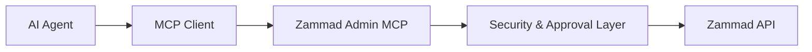

<div align="center">


# Zammad Admin MCP

### Secure AI Administration Bridge for Zammad

A controlled Model Context Protocol server for AI-assisted Zammad administration, automation and operational workflows.

</div>

---

## Overview

Zammad Admin MCP connects AI agents with Zammad administration capabilities through a controlled, auditable and permission-aware interface.

The goal is not unrestricted AI access to a helpdesk system.

The goal is a secure administration layer where every action can be reviewed, controlled and executed deliberately.

```
AI Agent
   |
   v
MCP Protocol Layer
   |
   v
Zammad Admin MCP
   |
   +-- Permission Control
   +-- Preview Before Apply
   +-- Audit-Oriented Workflow
   |
   v
Zammad API
```

---

# Core Principles

## 🔐 Security First

AI assistants should not receive uncontrolled administrative access.

Zammad Admin MCP uses:

- allowlisted resources and operations
- controlled API access
- preview before apply workflows
- explicit approval before changes
- secret redaction in responses
- protection against arbitrary API forwarding

---

## 🧠 AI-Assisted Administration

The MCP server provides structured access for AI systems while keeping administrators in control.

Supported workflows include:

- reading Zammad administration resources
- inspecting objects and configurations
- preparing controlled changes
- applying approved changes
- retrieving structured knowledge base data

---

# Architecture



---

# Current Capabilities

## Administration Access

- Read server version and allowlisted administration resources
- Paginated collection reads
- Object inspection
- Knowledge base access
- Structured administration workflows

## Controlled Changes

Changes are never executed directly when the server is loaded.

Workflow:

```
Prepare Change
      |
      v
Preview Before/After
      |
      v
Explicit Approval
      |
      v
Apply Change
```

Supported preparation workflows include:

- create operations
- update operations
- delete operations where explicitly allowed
- selected high-impact configuration workflows

---

# Security Model

Important design decisions:

- No arbitrary URL execution
- No arbitrary HTTP method forwarding
- No unrestricted Rails console access
- No hidden configuration changes
- No credential storage in Git

The MCP server does not increase Zammad permissions.

The Zammad API token permissions remain the authority for actual access.

---

# Installation

Clone the repository:

```bash
git clone https://github.com/CyberG3niusIT/Zammad-Admin-MCP.git
cd Zammad-Admin-MCP
```

Create environment:

```bash
python -m venv .venv
. .venv/bin/activate
pip install -e .
```

Start the MCP server:

```bash
zammad-admin-mcp
```

Configure your MCP client with the absolute path to the executable.

Keep credentials inside environment variables or local ignored configuration files.

---

# Available MCP Tools

Core tools:

- `zammad_server_version`
- `zammad_list_admin_resources`
- `zammad_list_admin_resource`
- `zammad_get_admin_object`
- `zammad_prepare_admin_change`
- `zammad_apply_admin_change`

Knowledge base tools:

- `zammad_get_knowledge_base`
- `zammad_get_knowledge_base_permissions`
- `zammad_get_knowledge_base_record`

Legacy compatibility readers:

- groups
- roles
- calendars
- SLAs
- triggers
- ticket states

---

# Limitations

This project intentionally avoids pretending to provide complete Zammad UI parity.

Currently not implemented:

- complete system settings coverage
- API token lifecycle management
- authentication provider management
- inbound mailbox configuration
- unrestricted object manager migrations

Unsupported areas should receive dedicated, reviewed workflows instead of generic API access.

---

# Development Philosophy

Zammad Admin MCP follows a simple principle:

> AI should operate as a controlled administrator, not as an uncontrolled superuser.

Every new capability should define:

- permissions
- side effects
- validation rules
- secret handling
- rollback considerations

---

# References

- [Zammad REST API](https://docs.zammad.org/en/latest/api/intro.html)
- [Object Manager API](https://docs.zammad.org/en/latest/api/object.html)
- [Email Notification API](https://docs.zammad.org/en/pre-release/api/email-notification.html)
- See `ADMIN_COVERAGE.md` for detailed coverage information.

---

## License

Open source project by CyberG3niusIT.
